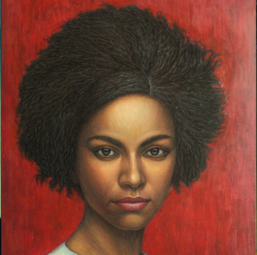

# 🎭 AI Face - Talking Head Generation System

<div align="center">


**Generate realistic talking head videos from static images and audio**

[](https://www.python.org/downloads/)
[](https://flask.palletsprojects.com/)
[](https://reactjs.org/)
[](LICENSE)

</div>

---

## ✨ Features

- 🎬 **Realistic Talking Head Generation**: Transform static images into animated talking faces
- 🎵 **Audio-Driven Animation**: Use any audio file to drive facial expressions and lip movements
- 🖼️ **Multiple Input Formats**: Support for images (PNG, JPG) and videos (MP4, WEBM)
- 🌐 **Modern Web Interface**: Built with React + TypeScript + Vite for a seamless user experience
- 📊 **Database Integration**: Track video generation progress and history
- 🔄 **Real-time Preview**: Watch your video being generated in real-time
- 🎨 **Customizable Output**: Adjust various parameters for different animation styles
- 📱 **Responsive Design**: Works seamlessly on desktop and mobile devices

---

## 🎥 Sample Results

### Example 1: Portrait Animation

<div align="center">

**Input Image** | **Generated Video**
:---:|:---:
 | <video src="static/results/art_1_imagine.mp4" width="300" controls></video>

*Transforming a static portrait into an animated talking head*

</div>

---

### Example 2: Celebrity Animation

<div align="center">

**Input Video** | **Generated Video**
:---:|:---:
<video src="uploads/WDA_AlexandriaOcasioCortez_000.mp4" width="200" controls></video> | <video src="static/results/art_11_WDA_AlexandriaOcasioCortez_000.mp4" width="300" controls></video>

*Animating a celebrity video with enhanced lip-sync*

</div>

---

### Example 3: Full Body Animation

<div align="center">

**Input Image** | **Generated Video**
:---:|:---:
 | <video src="static/results/full3_imagine.mp4" width="300" controls></video>

*Full body portrait animation with natural movements*

</div>

---

### Example 4: News Anchor Style

<div align="center">

**Input Video** | **Generated Video**
:---:|:---:
<video src="uploads/WDA_AlexandriaOcasioCortez_000.mp4" width="200" controls></video> | <video src="static/results/art_13_chinese_news.mp4" width="300" controls></video>

*Professional news anchor style animation*

</div>

---

### Example 5: Custom Portrait

<div align="center">

**Input Video** | **Generated Video**
:---:|:---:
<video src="uploads/suyash_browser.mp4" width="200" controls></video> | <video src="static/results/suyash_suyash_browser.mp4" width="300" controls></video>

*Custom portrait animation with personalized expressions*

</div>

---

## 🚀 Quick Start

### Prerequisites

- Python 3.10 or higher
- Node.js 18 or higher (for the React frontend)
- CUDA-capable GPU (recommended for faster processing)

### Installation

1. **Clone the repository**
```bash
git clone https://github.com/Suyash-Sonawane/AI-face-.git
cd AI-face-
```

2. **Install Python dependencies**
```bash
pip install -r requirements.txt
```

3. **Install frontend dependencies**
```bash
cd app
npm install
```

4. **Download required models**
```bash
bash scripts/download_models.sh
```

### Running the Application

1. **Start the Flask backend**
```bash
python app_flask.py
```

2. **Start the React frontend** (in a new terminal)
```bash
cd app
npm run dev
```

3. **Open your browser**
Navigate to `http://localhost:5173` to access the web interface

---

## 📖 Usage Guide

### Web Interface

1. **Upload your source image or video**
   - Supported formats: PNG, JPG, MP4, WEBM
   - Maximum file size: 50MB

2. **Upload your audio file**
   - Supported formats: MP3, WAV, M4A
   - Maximum file size: 20MB

3. **Configure generation parameters**
   - **Enhancer**: Enable/disable face enhancement
   - **Still Mode**: Use still image mode for better quality
   - **Preprocess**: Choose face crop method

4. **Generate your video**
   - Click "Generate" to start the process
   - Monitor progress in real-time
   - Download the result when complete

### API Usage

The application also provides a REST API for programmatic access:

```python
import requests

# Generate a talking head video
response = requests.post('http://localhost:5000/api/generate', 
    files={
        'source_image': open('input.jpg', 'rb'),
        'audio': open('audio.mp3', 'rb')
    },
    data={
        'enhancer': 'gfpgan',
        'still_mode': 'true'
    }
)

result = response.json()
print(f"Video generated: {result['video_url']}")
```

---

## 🏗️ Project Structure

```
AI-face-/
├── app/                      # React frontend application
│   ├── src/
│   │   ├── components/       # React components
│   │   ├── hooks/           # Custom React hooks
│   │   └── main.tsx         # Application entry point
│   └── package.json         # Frontend dependencies
├── src/                      # Core SadTalker implementation
│   ├── face3d/             # 3D face reconstruction
│   ├── facerender/         # Face rendering modules
│   ├── audio2exp_models/   # Audio to expression models
│   ├── audio2pose_models/  # Audio to pose models
│   └── utils/              # Utility functions
├── static/                  # Static files
│   ├── results/            # Generated videos
│   ├── previews/           # Preview videos
│   ├── css/                # Stylesheets
│   └── js/                 # JavaScript files
├── uploads/                 # User uploaded files
├── checkpoints/             # Pre-trained models
├── docs/                    # Documentation
├── scripts/                 # Utility scripts
├── app_flask.py            # Flask application entry point
├── api_routes.py           # API routes
├── database.py             # Database operations
├── config.py               # Configuration settings
└── requirements.txt        # Python dependencies
```

---

## 🔧 Configuration

### Model Configuration

Edit the configuration files in `src/config/`:

- `auido2exp.yaml`: Audio to expression model settings
- `auido2pose.yaml`: Audio to pose model settings
- `facerender.yaml`: Face rendering parameters
- `facerender_still.yaml`: Still image rendering parameters

### Application Settings

Modify `config.py` to customize:

```python
# Database settings
DATABASE_PATH = "sadtalker.db"

# Directory paths
UPLOAD_DIR = "uploads"
RESULT_DIR = "static/results"
PREVIEW_DIR = "static/previews"

# Model settings
CHECKPOINT_DIR = "checkpoints"
CONFIG_DIR = "src/config"
```

---

## 🎨 Advanced Features

### Face Enhancement

The application includes GFPGAN for face enhancement:

```python
# Enable face enhancement
enhancer = "gfpgan"
```

### Reference Video

Use a reference video to guide the animation style:

```python
# Specify reference video
ref_video = "path/to/reference.mp4"
```

### Batch Processing

Process multiple videos at once:

```python
from src.generate_batch import generate_batch

videos = [
    {"image": "img1.jpg", "audio": "audio1.mp3"},
    {"image": "img2.jpg", "audio": "audio2.mp3"}
]

results = generate_batch(videos)
```

---

## 📊 Performance Optimization

### GPU Acceleration

Ensure CUDA is properly configured:

```python
import torch
print(f"CUDA available: {torch.cuda.is_available()}")
print(f"CUDA device: {torch.cuda.get_device_name(0)}")
```

### Memory Management

For large videos, adjust batch size:

```python
# In src/config/facerender.yaml
batch_size: 1  # Reduce if running out of memory
```

---

## 🐛 Troubleshooting

### Common Issues

1. **Out of Memory Error**
   - Reduce batch size in configuration
   - Use a smaller input image
   - Close other GPU-intensive applications

2. **Poor Lip Sync**
   - Ensure audio quality is good
   - Try different preprocessing methods
   - Use a reference video for better results

3. **Slow Generation**
   - Enable GPU acceleration
   - Use still mode for faster processing
   - Reduce video resolution

---

## 📚 Documentation

- [Installation Guide](docs/install.md)
- [Best Practices](docs/best_practice.md)
- [FAQ](docs/FAQ.md)
- [Changelog](docs/changlelog.md)
- [Face3D Documentation](docs/face3d.md)
- [WebUI Extension](docs/webui_extension.md)

---

## 🤝 Contributing

Contributions are welcome! Please follow these steps:

1. Fork the repository
2. Create a feature branch (`git checkout -b feature/AmazingFeature`)
3. Commit your changes (`git commit -m 'Add some AmazingFeature'`)
4. Push to the branch (`git push origin feature/AmazingFeature`)
5. Open a Pull Request

---

## 📄 License

This project is licensed under the MIT License - see the [LICENSE](LICENSE) file for details.

---

## 🙏 Acknowledgments

- [SadTalker](https://github.com/OpenTalker/SadTalker) - Original SadTalker implementation
- [GFPGAN](https://github.com/TencentARC/GFPGAN) - Face enhancement model
- [Flask](https://flask.palletsprojects.com/) - Web framework
- [React](https://reactjs.org/) - Frontend framework

---

## 📞 Contact

- **Author**: Suyash Sonawane 9561155148
- **Email**: sonawanesuyash261@gmail.com
- **GitHub**: [@Suyash-Sonawane](https://github.com/Suyash-Sonawane)

---

<div align="center">

**⭐ If you find this project helpful, please consider giving it a star! ⭐**

Made with ❤️ by Suyash Sonawane

</div>
